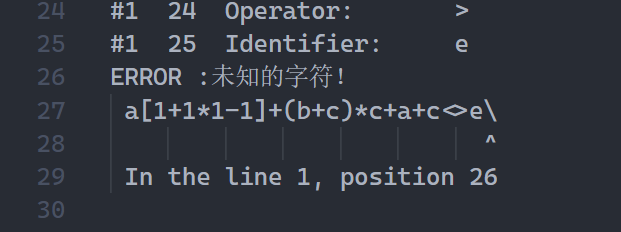
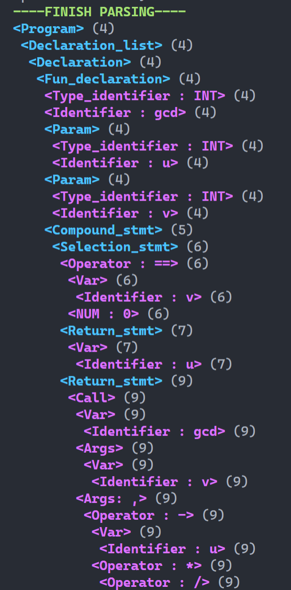
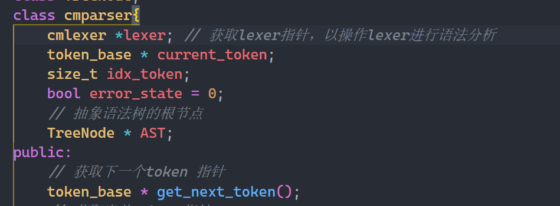

# CMinus 词法分析器和语法分析器
> 本项目基于C++开发
- 本仓库为四川大学编译原理课程设计仓库
- 目标为完成CMinus词法分析器和语法分析器，本质上是C语言的一个子集，功能较为简单，便于本科生快速实现理解原理。其[具体词法语法规则参见此链接](documents/CMinus词法和语法规则.md)
- 仓库内容按模块分为`lexer`和`parser`的子文件夹，分别实现了**词法分析器**和**语法分析器**对应的功能。

## 功能展示
### 词法分析器 Lexer
> 有些教材会称作scanner而非本文用的lexer
> 
在`./lexer`文件夹下运行`make.bat`后，会默认从`./lexer/test_cases`下的`input.c`文件读入信息

结果会在内部转化为一个装有所有`token`类型的`vector`，同时会在`./lexer/test_cases/output.txt`中展示每一个词法单元的类型，值，行号和列号。

- 一个经典的例子：
  - 输入：
    ```c {class=line-numbers}
      /* A program to perform Euclid's
      Algorithm to compute gcd. */

      int gcd (int u, int v)
      { 
          if (v == 0)
              return u ;
          else
              return gcd(v,u-u/v*v);
          /* u-u/v*v ==
          u mod v */
      }

      void main(void)
      {
          int x; int y;
          x = input();
          y = input();
          output(gcd(x,y));
      }
    ```

  - 输出
    ```c{class=line-numbers}
      #4	3	Keyword:      	int
      #4	7	Identifier: 	gcd
      #4	9	Operator:   	(
      #4	12	Keyword:      	int
      #4	14	Identifier: 	u
      #4	15	Operator:   	,
      #4	19	Keyword:      	int
      #4	21	Identifier: 	v
      #4	22	Operator:   	)
      #5	1	Operator:   	{
      #6	6	Keyword:      	if
      #6	8	Operator:   	(
      #6	9	Identifier: 	v
      #6	12	Operator:   	==
      #6	14	Number:     	0
      #6	15	Operator:   	)
      #7	14	Keyword:      	return
      #7	16	Identifier: 	u
      #7	18	Operator:   	;
      #8	8	Keyword:      	else
      #9	14	Keyword:      	return
      #9	18	Identifier: 	gcd
      #9	19	Operator:   	(
      #9	20	Identifier: 	v
      #9	21	Operator:   	,
      #9	22	Identifier: 	u
      #9	23	Operator:   	-
      #9	24	Identifier: 	u
      #9	25	Operator:   	/
      #9	26	Identifier: 	v
      #9	27	Operator:   	*
      #9	28	Identifier: 	v
      #9	29	Operator:   	)
      #9	30	Operator:   	;
      #12	1	Operator:   	}
      #14	4	Keyword:      	void
      #14	9	Identifier: 	main
      #14	10	Operator:   	(
      #14	14	Keyword:      	void
      #14	15	Operator:   	)
      #15	1	Operator:   	{
      #16	7	Keyword:      	int
      #16	9	Identifier: 	x
      #16	10	Operator:   	;
      #16	14	Keyword:      	int
      #16	16	Identifier: 	y
      #16	17	Operator:   	;
      #17	5	Identifier: 	x
      #17	7	Operator:   	=
      #17	13	Identifier: 	input
      #17	14	Operator:   	(
      #17	15	Operator:   	)
      #17	16	Operator:   	;
      #18	5	Identifier: 	y
      #18	7	Operator:   	=
      #18	13	Identifier: 	input
      #18	14	Operator:   	(
      #18	15	Operator:   	)
      #18	16	Operator:   	;
      #19	10	Identifier: 	output
      #19	11	Operator:   	(
      #19	14	Identifier: 	gcd
      #19	15	Operator:   	(
      #19	16	Identifier: 	x
      #19	17	Operator:   	,
      #19	18	Identifier: 	y
      #19	19	Operator:   	)
      #19	20	Operator:   	)
      #19	21	Operator:   	;
      #20	1	Operator:   	}
    ```

    每一个`Token`和源代码中的内容一一对应。
- 此lexer具有一些基本的报错能力：
  

### 语法分析器 Parser
对于语法分析器，则可以在`parser`文件夹下运行对应的`make.bat`来将`./parser/test_cases`下的`input.c`文件的内容转化为语法树，并以缩进和颜色的方式输出对应的语法树，同样对于上面的例子，有如下结果：

  

本质上`parser`的成员中含有一个`lexer`的指针，使用了`lexer`的`get_next_token()`成员函数作为输入逐一分析。

  
## CMAKE编译指令
本项目采用`CMake`构建，是C/C++工程开发目前最常见的集成工具之一，如果你不熟悉CMAKE，可以参考如下两个仓库学习如何使用CMAKE编译C/C++工程文件：

[](https://github.com/SFUMECJF/cmake-examples-Chinese)

[](https://github.com/ttroy50/cmake-examples)

> 跟着上面的教程走一遍，大概1个多小时能掌握基本的使用方法。而事实上，如果你不想这么麻烦，大致把头文件`*.h`和`*.cpp`文件适当组装到一个文件中也是能正常运行的，不过不便于debug和寻找模块对应代码。

--------
掌握CMAKE之后（或者只打算跑一下demo看看结果），请将路径切换到对应文件夹模块下来编译源代码：
### 直接编译方式：
在目录下提供了`make.bat`文件，在`Windows`环境下，安装过CMAKE之后，可以通过在命令行中批处理来自动化完成编译运行过程。
```powershell
./make.bat
```
### 手动编译方式
- 在build路径中执行如下指令以获得`MinGW Makefiles`(我这里使用minGW编译，如果你有其他的编译工具，请自行选择）：
```
cmake .. -G 'MinGW Makefiles'
```
- 随后在这个文件夹下运行·MinGW·即可开始编译：
```
mingw32-make.exe
``` 
- 在**命令行中运行**根目录下得到的`*.exe`文件即可。
```powershell
./CMinusLexer_binary.exe
```

--------

祝大家学有所成， 欢迎反馈bug等信息~ :)